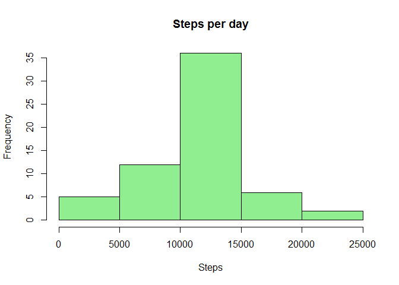

# Reproducible Research: Peer Assessment 1


## Loading and preprocessing the data


```r
q1data <- read.csv("activity.csv")
cleandata<-na.omit(q1data)
```

## What is mean total number of steps taken per day?


```r
stepsperday <- aggregate(steps ~ date, data=cleandata,sum)
hist (stepsperday$steps, xlab = "Steps", col = "lightgreen", main = "Steps per day")
```

 

```r
print (paste("Mean steps per day is",mean(stepsperday$steps)))
```

```
## [1] "Mean steps per day is 10766.1886792453"
```

```r
print (paste("Median steps per day is",median(stepsperday$steps)))
```

```
## [1] "Median steps per day is 10765"
```

## What is the average daily activity pattern?

```r
stepsperinterval <- aggregate(steps ~ interval, data=cleandata,mean)
## make the plot
with(stepsperinterval, plot(steps ~ interval, main = "Steps per interval", type = "l"))
```

 

```r
## maximum steps. What interval?
maxsteps<- which.max(stepsperinterval$steps)
maxint<-stepsperinterval[maxsteps, "interval"]
print(paste("An interval for maximum steps (average per day) is", maxint))
```

```
## [1] "An interval for maximum steps (average per day) is 835"
```

## Imputing missing values

```r
## Bad rows
badrows <- nrow(q1data) - nrow(cleandata)
print(paste("The total numbers of bad data rows are", badrows))
```

```
## [1] "The total numbers of bad data rows are 2304"
```

```r
##filling the empty values
q2data<-q1data
nr <- nrow(q2data)
for (i in 1:nr) {
    if (is.na(q2data[i,"steps"])) {
        int <- q2data[i,"interval"]
        q2data[i,"steps"] <- stepsperinterval[stepsperinterval$interval== int, "steps"]
    }
}
stepsperday2 <- aggregate(steps ~ date, data=q2data,sum)
## make the histogram
hist (stepsperday2$steps, xlab = "Steps", col = "lightgreen", main = "Steps per day")
```

 

```r
print (mean(stepsperday2$steps))
```

```
## [1] 10766.19
```

```r
print (median(stepsperday2$steps))
```

```
## [1] 10766.19
```
## Are there differences in activity patterns between weekdays and weekends?

```r
wkd <-factor(c("weekday", "weekend"))
for (i in 1:nrow(q2data)) {
    wd <- as.POSIXlt(q2data[i, "date"])$wday
    if ((wd !=0) &(wd !=6)) {
        q2data[i, "Wkd"] <- wkd[1]
    } else{
        q2data[i, "Wkd"] <- wkd[2]
    }
}
stepsperinterval2 <- aggregate(steps ~ interval+Wkd, data=q2data, mean)
## make a panel plot
library(lattice)
xyplot(steps ~ interval | Wkd, data = stepsperinterval2, layout = c(1,2), 
       type = 'l', ylab ="Number of steps")
```

 
